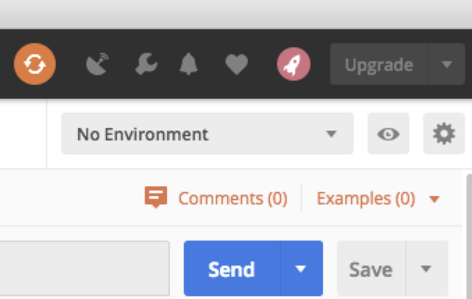
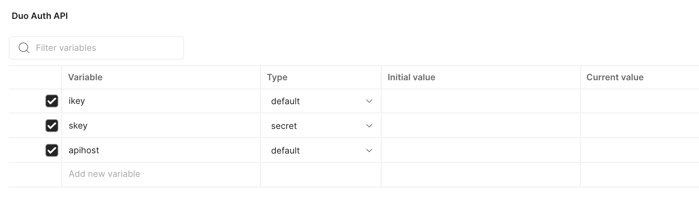
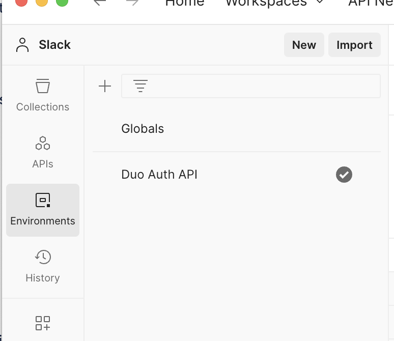
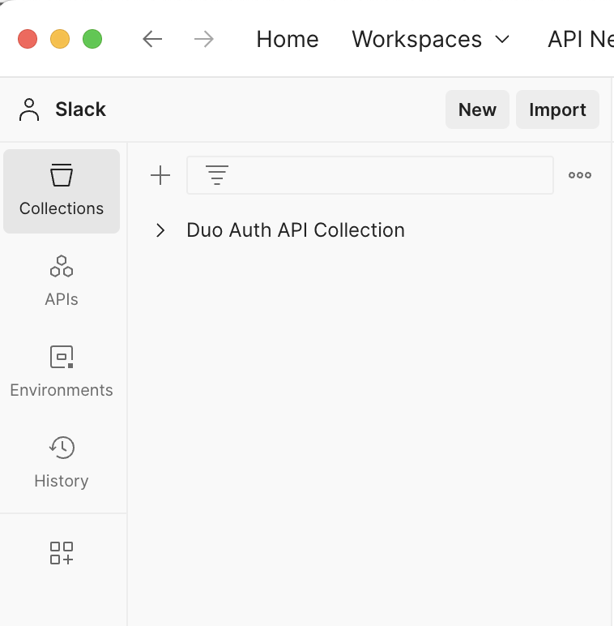
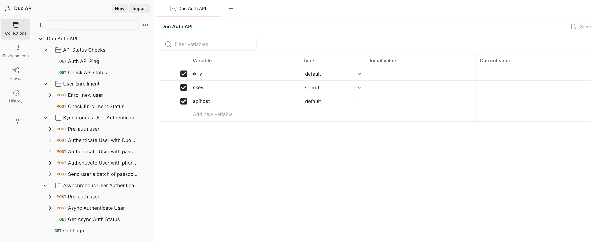

# duo-auth-api
Duo Auth API

The Duo Auth API provides programmatic access to the administrative functionality of Duo Security's two-factor authentication platform.

The Auth API lets developers integrate with Duo Security's platform at a low level. The API has methods for verifying Duo service connectivity and integration info, retrieving the enrollment status and available authentication devices for a user, and performing authentication.
Developers can add Duo two-factor authentication into existing applications that already have a method for primary authentication.
Review the API Details to see how to construct your first API request.

Postman Configuration using Pre-built Templates

Setting Up Multiple Environments
Postman environments can be used to allow a user to change the properties/headers of a request on the fly. Since the Duo requests must have the authentication headers regenerated upon each new request, this works REALLY well with environments. Below is an example of how to set this up.

Adding an environment:

1. In Postman, the Environment dropdown lives in the upper right. By default, no environments are configured. To add an environment, click the Eye icon, then click Add:

2. Add your specific ikey, skey, apihost as Variables and add your Admin/Auth API integration keys in as the current values. 

Import Postman Environment Template

First, the Duo Auth API Postman Environment template needs to be imported into the Postman application.
1. Open the Postman application, if it is not open already.
2. In the left panel, select the Environments tile. If there is no Environments tile displayed, select the  tile at the bottom of the left panel and then make sure the toggle slider is enabled for the Environments sidebar item.

3. Download this Postman Duo Auth API Environment template file.
4. Select the Import button in the upper right of the Environments section.
5. Browse to the JSON file downloaded in step #3 above.
6. Select the new Duo Admin API entry and verify that there are variables defined for:
ikey
skey
apihost

Import Postman Collections Template

Second, the Duo Auth API Postman Collections template needs to be imported into the Postman application.
1. Open the Postman application, if it is not open already.
2. In the left panel, select the Collections tile. If there is no Collections tile displayed, select the tile at the bottom of the left panel and then make sure the toggle slider is enabled for the Collections sidebar item.

3. Download this Postman Duo API Collections template file.
4. Select the Import button in the upper right of the Environments section.
5. Browse to the JSON file downloaded in step #3 above.
6. Select the new Duo Auth API Collection entry and verify the Pre-request Script is populated.

7. Expand the Duo Auth API Collection item to reveal two example requests.

Using the Templates
Once the templates have been imported, they require the standard three pieces of information from either a Duo Admin API or Duo Auth API application integration.

Adding the Duo API credentials
Navigate to the Duo Auth API environment within Postman and update the Current value rows for each of the ikey, skey, and apihost with information from the Duo Auth API integration from the account will be tested. Click the save button in the upper right if the values should be stored for future use after the Postman application has been closed.
